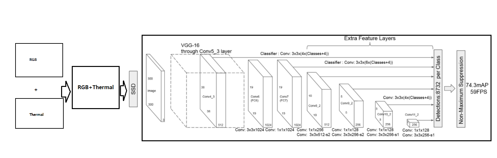

# ssd guillotine project  
SSD[2] (Object detection Model) Implementation on Kaist pedestrian multispectral dataset[1]
# Goal
- To understand SSD model
- To apply SSD model to Kaist Pedestrain dataset.

## Architecture

## DataAugmentation
Nothing
## Data Preprocessing
Normalization

## train 
### initialization
- baseline0
initialized with pretrained SSD weights (pre-trained on VOC dataset)  
[SSD300 trained on VOC](https://s3.amazonaws.com/amdegroot-models/ssd300_mAP_77.43_v2.pth)
- baseline1

### parameter
optimizer : SGD(lr=0.001)  
loss : MultiBoxLoss (same as original paper[2])  

=======

# Todo (default)  

- [X] Make kaist dataset be small size (for working on colab)
- [X] split(train,val,test) 
  - [X] tr,val, test (155, 52, 69)
- [ ] Dataset&DataLoader
- [ ] SSD model 
- [ ] train 

### NEXT 
- diverse optimizers; AdamP[3], Madgrad[4]
- augmentation in object detection
- Few shot learning in small dataset

 
# ETC 
## kaist dataset[1]  
origin : https://soonminhwang.github.io/rgbt-ped-detection/  
download : https://gofile.me/4ce0I/uRhsZ8nnF  
## kaist dataset annotation
github : https://github.com/luzhang16/AR-CNN   
download : https://drive.google.com/open?id=1FLkoJQOGt4PqRtr0j6namAaehrdt_A45  
## ssd baseline code 
baseline0 : https://github.com/amdegroot/ssd.pytorch/tree/5b0b77faa955c1917b0c710d770739ba8fbff9b7  (it has many bugs,damm)
baseline1 : https://github.com/sgrvinod/a-PyTorch-Tutorial-to-Object-Detection 

## another tools (related to Object detection )
object detection framework : https://github.com/open-mmlab/mmdetection

#reference  
- [1] S. Hwang, J. Park, N. Kim, Y. Choi, and I. S. Kweon, “Multispectral Pedestrian Detection: Benchmark Dataset and Baseline.” Accessed: May 07, 2021. [Online]. Available: http://rcv.kaist.ac.kr/multispectral-pedestrian/.
- [2] W. Liu et al., “SSD: Single Shot MultiBox Detector.” Accessed: May 07, 2021. [Online]. Available: https://github.com/weiliu89/caffe/tree/ssd.
- [3] B. Heo et al., “ADAMP: SLOWING DOWN THE SLOWDOWN FOR MO-MENTUM OPTIMIZERS ON SCALE-INVARIANT WEIGHTS Equal contribution * , Works done at Naver AI Lab †.” Accessed: May 07, 2021. [Online]. Available: https://github.com/clovaai/adamp.
- [4] A. Defazio and S. Jelassi, “Adaptivity without Compromise: A Momentumized, Adaptive, Dual Averaged Gradient Method for Stochastic Optimization,” pp. 1–31, 2021, [Online]. Available: http://arxiv.org/abs/2101.11075.

